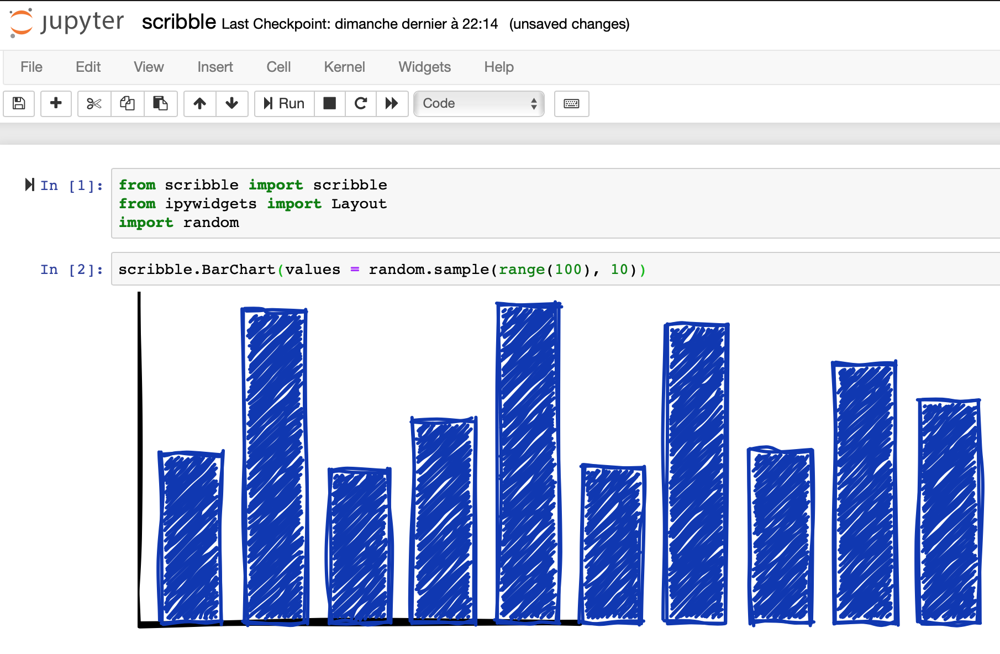

scribble
===============================

Draw 2D primitives in a sketchy look, from p5.scribble.js

Installation
------------

To install use pip:

    $ pip install scribble
    $ jupyter nbextension enable --py --sys-prefix scribble

For a development installation (requires npm),

    $ git clone https://github.com/moz411/scribble.git
    $ cd scribble
    $ pip install -e .
    $ jupyter nbextension install --py --symlink --sys-prefix scribble
    $ jupyter nbextension enable --py --sys-prefix scribble
